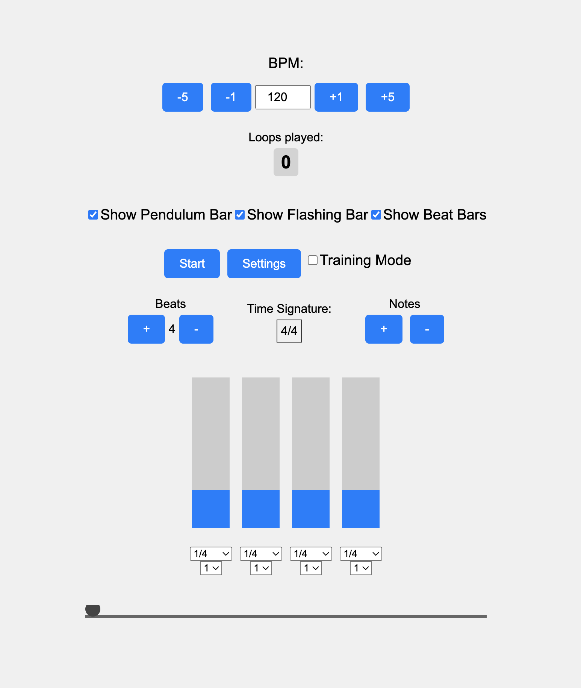

# Metronome 2

[](https://github.com/dolamore/music-assistant/actions/workflows/tests.yml)

A web-based drummer assistant that helps user to practice rhythms and improve timing.

<p align="left">
  
</p>

## Technology Stack

- **Core:** TypeScript, Node.js, Tone.js
- **Frontend:** React, MobX
- **Backend:** NestJS, Prisma, Swagger
- **Database:** PostgreSQL, MongoDB
- **Build & Bundling:** Webpack, Vite, Electron, Babel
- **DevOps & CI/CD:** Docker, GitHub Actions
- **Testing & QA:** Jest, Playwright, Postman
- **Logging & Monitoring:** Winston
- **DevTools:** ESLint, Prettier

## Features

- Set up complex rhythms including triplets, accents, variable amount, and combinations of notes
- Assign and custom different sounds to different beats with an advanced settings panel
- Click a beat to get another prebuilt sound
- Adjust BPM using input or buttons
- Calculate time signature
- Pendulum follows the beat
- Flashing lights for beats
- Training mode with adjustable probabilities of loop or note skipping
- Loop counter

## Roadmap

Here's what I plan to implement in future updates:

- Add support for polyrhythms.
- Add rudiments practice task generator.
- Gamify the process with an achievement and a level system
- Implement user authentication for a personalized experience.
- Add note icons for more complex and visually appealing setups.
- Add MIDI support for external drum kits.

## Installation

### 1. Clone the repository:

```sh
  git clone https://github.com/dolamore/metronome.git
  ```

### 2. Navigate to the project directory:

```sh
  cd metronome
  ```

### 3. Install the dependencies:

```sh
   npm install
```

### 4. Run the application:

- **4.1 In a browser using Vite server:**
  ```sh
   npm run dev
  ```

  [Visit http://localhost:3001 to open the app](http://localhost:3001)

[If 3001/3002/... are busy, it will be available at 3002/3003/... accordingly.]

- **4.2 Run the application in a browser using Docker:**

   ```sh
     docker build -t metronome .
   ```

   ```sh
     npm run dev:docker
   ```

  [Visit http://localhost:3001 to open the app](http://localhost:3001)

[Change port in `docker-compose.yml` if 3001/3002/... are busy.]

- **4.3 Run the application with electron:**

   ```sh
     npm start
   ```

## Architecture

The architecture of **Metronome 2** follows a **modular and scalable design**, ensuring flexibility and maintainability.
Below are the key principles and components that shape the project's structure.

### 1. **Modular Structure**

The project is divided into distinct modules, each responsible for a specific aspect of the application:

- **Frontend:** Built using **React** for UI components and **MobX** for state management.
- **Backend:** Powered by **NestJS** with **Prisma** as ORM and **PostgreSQL** as the database.
- **Audio Engine:** Custom audio functionality is handled by **Tone.js** integrated with a modular system for handling
  rhythms, beats, and sound generation.

### 2. **Component-Based Design**

The frontend uses a **component-based architecture** with React, enabling reusable UI elements that can be easily
modified and extended. State management is handled using **MobX**, which ensures a predictable and reactive UI,
especially when syncing user interactions and audio playback.

### 3. **Backend Services**

The backend is built with **NestJS**, providing a robust framework to handle API requests, authentication, and business
logic. The backend communicates with the database using **Prisma** to manage data models and database operations
efficiently. The database itself is **PostgreSQL**, ensuring data integrity and scalability.

### 4. **Audio Engine**

At the heart of the application is a custom-built **audio engine** built on top of **Tone.js**. The engine is designed
to handle:

- Complex rhythm patterns, including triplets, accents, and varied note lengths.
- The dynamic assignment of sounds to different beats.
- Customizable sound properties, such as volume, pan, and pitch.
- Real-time beat timing and synchronization.

The audio engine is modular and encapsulated, allowing easy swapping or extension with other audio libraries in the
future.

### 5. **Reactive architecture based on the MVVM (Model-View-ViewModel)**


The application uses a reactive architecture based on the MVVM (Model-View-ViewModel) pattern:

- **Model**: Managers (MetronomeManager and others) contain business logic and manage data
- **View**: React components represent the user interface
- **ViewModel**: MobX store connects Model and View, providing reactive UI updates

When a user interacts with the interface (e.g., changes BPM), React components call manager methods that update the state in MobX. Thanks to MobX's reactivity, the UI automatically updates in response to these changes. This approach ensures clean separation of concerns and predictable data flow.

Benefits of this architecture:
- Declarative UI updates without the need to manually manage the DOM
- Clear separation of business logic (managers) from presentation (components)
- Automatic tracking of dependencies between data and UI
- Predictable unidirectional data flow

### 6. **CI/CD Pipeline and Deployment**

The project uses **Docker** for containerization, making the application easily portable and consistent across
environments. The deployment process is automated using **GitHub Actions**, ensuring that tests run automatically with
every code push, maintaining code quality.

### 8. **Scalability and Maintainability**

- The modular nature of the architecture allows new features to be easily added without affecting existing code.
- The backend is designed to handle increasing traffic and users, while the audio engine is optimized for real-time
  performance.
- The frontend can be extended with new UI components or visualizations as needed, without significant changes to the
  underlying logic.

This architecture ensures that **Metronome 2** remains maintainable, scalable, and easy to extend as new features are
added in the future.

## Testing

**Metronome 2** uses a comprehensive testing strategy to ensure reliability and maintainability of the application. The
testing setup includes both unit and end-to-end (E2E) tests.

### Testing Stack

- **Unit Testing:** [Jest](https://jestjs.io/)
- **E2E Testing:** [Playwright](https://playwright.dev/)
- **API Testing:** [Postman](https://www.postman.com/)
- **Test Coverage:** Built-in Jest coverage reports

### Running Tests

- **Complete tests:**
  ```sh
  npm run test
  ```
- **Unit tests (Jest):**
  ```sh
  npm run test:unit
  ```
- **E2E tests (Playwright):**
  ```sh
  npm run test:e2e
  ```
- **Test coverage:**
  ```sh
  npm run test:coverage
  ```

- **Docker-based test runner:**
  ```sh
  docker build -t metronome-test .
  ```
  ```sh
  docker compose --profile test up --abort-on-container-exit
  ```

### Additional Notes
- Tests are automatically run on each push via GitHub Actions.
- E2E tests use Chromium in a headless Docker container.
- Use
   ```sh
  npm run test:watch
  ```
  for test-driven development workflows.

## License

This project is licensed under the MIT License.